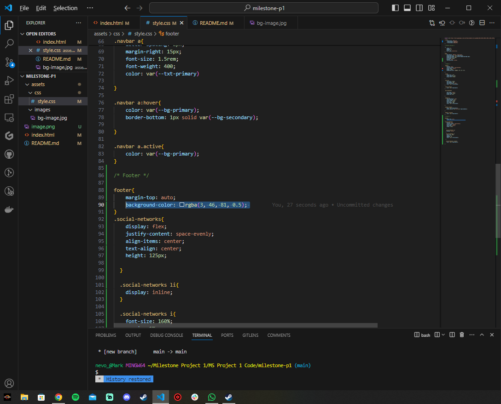
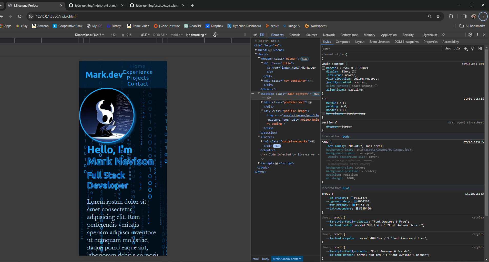
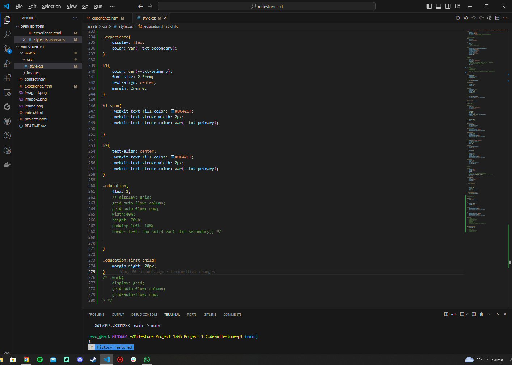
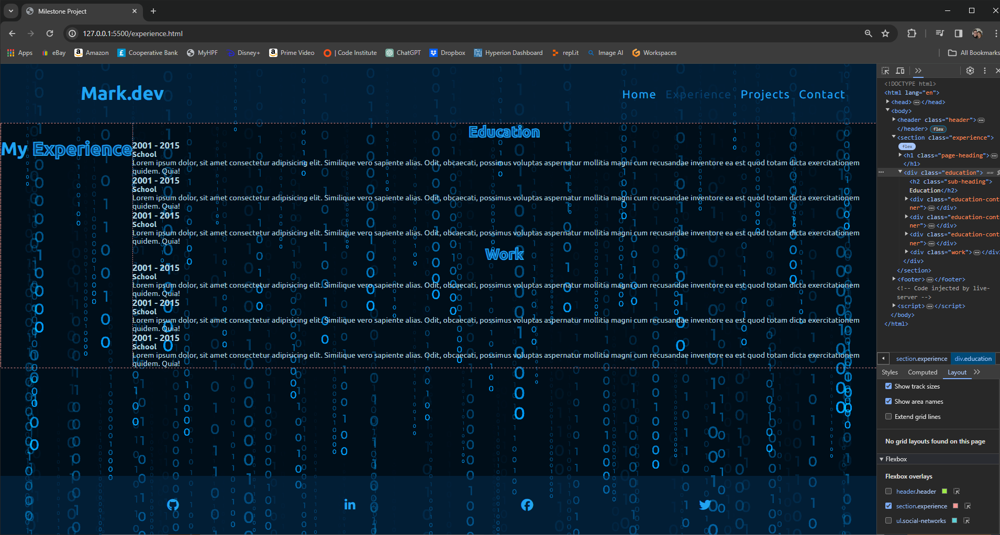

# Milestone Project #1

https://stackoverflow.com/questions/43809872/css-issue-with-header-and-nav-list-not-aligning - help with aligning title and nav

https://www.freepik.com/free-vector/matrix-style-binary-code-digital-falling-numbers-blue-background_24600855.htm#fromView=search&page=1&position=12&uuid=f3a21a98-cbd2-45e2-ba34-23210db7aaf8 - bg image "@starline - Freepik

https://www.30secondsofcode.org/css/s/footer-at-the-bottom/#:~:text=You%20can%20use%20flexbox%20to,and%20flex%2Ddirection%3A%20column%20. - code for getting my footer and header spaced correctly

https://codepen.io/cbracco/pen/kQmVGM - helped with getting footer to remain on the bottom of the page

card design: https://codepen.io/Incorr3ct/pen/ExvYJvN

bug with newly added form 