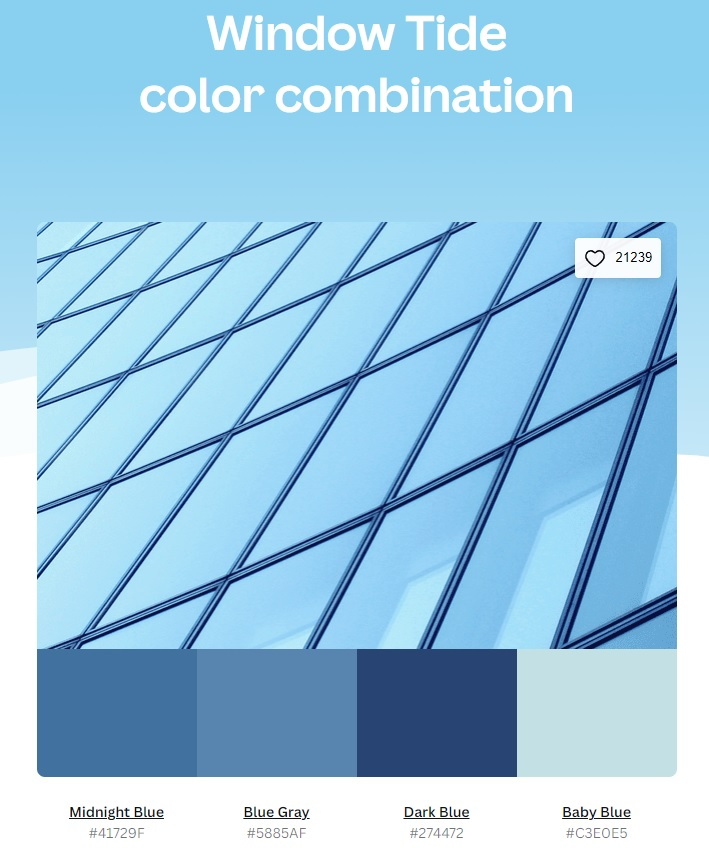
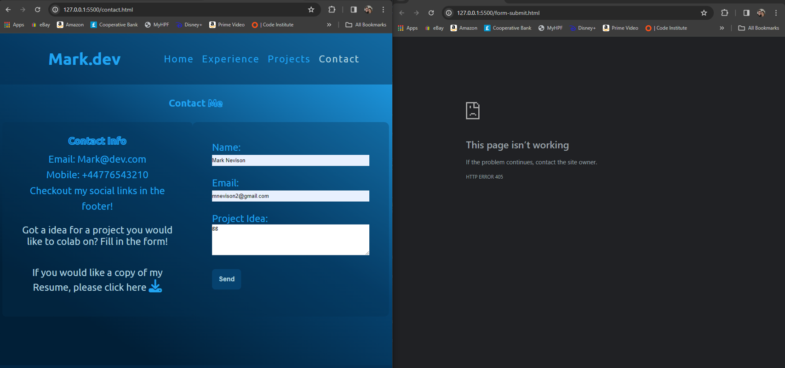

# Mark.dev - Milestone Project 1

Visit the deployed site: [Mark.dev](https://mnevison.github.io/milestone-p1/index.html)

As someone who is wanting to progress forward in Tech, I heard many people speak about "portfolios" and how important they are when looking for jobs. I wanted to design myself a website that would give the user a bit of useful information about me, while also displaying my knowledge and abilities either through the site its self, or projects I outline within the pages of the site.

## Contents

- [User Experience](#user-experience-ux)

  - [User Stories](#user-stories)

- [Design](#design)

  - [Colour Scheme](#colour-scheme)
  - [Typography](#typography)
  - [Imagery](#imagery)
  - [Wireframes](#wireframes)
  - [Features](#features)

    - [Homepage](#home-page)
    - [Experience](#experience)
    - [Projects](#projects)
    - [Contact](#contact)
    - [Form Submit](#form-submit)
    - [404](#404)
    - [Site Wide](#site-wide)
    - [Future Updates/Changes](#future-improvementschanges)

  - [Accessability](#accessibility)

- [How It Was Built](#how-it-was-built)

  - [Languages Used](#languages-used)
  - [Libraries, Websites & Programs Used](#libraries-websites--programs-used)

- [Deployment & Local Development](#deployment--local-development)

  - [Deployment](#deployment)
  - [Local Development](#local-development)

- [Testing](#testing)

  - [Solved Bugs](#solved-bugs)
  - [Known Bugs](#known-bugs)

- [Credits](#credits)

  - [Code Used](#code-used)
  - [Page Content](#page-content)
  - [Media](#media)
  - [Acknowledgements](#acknowledgements)

---

## User Experience (UX)

### User Stories

#### First Time Visitor Goals

- I want to get useful information about this person.
- I want the site to work on my chosen device.
- I want to find my way around the site easily.

#### Returning Visitor Goals

- I want to be able to explore more of what this person has to offer.

#### Frequent Visitor Goals

- I want to have the option to reach out and communicate with this person.

---

## Design

### Colour Scheme

As the page is meant to be a personal profile, I went with my favorite colour. With that as my starting point, I went to Google to try and find a resource that would give me an idea about good colour combinations. I found [Canva](https://www.canva.com/colors/color-palettes/), which had more than enough potential to pick something that popped for me.

Initially I settled on the "Window Tide" scheme.

However, early on in the development of the site I wanted a background image that would fulfil 2 roles:

1. Be "Techy".
2. Have a similar colour scheme to what I've picked.

I came across this on [Freepik](https://www.freepik.com/free-vector/matrix-style-binary-code-digital-falling-numbers-blue-background_24600855.htm#fromView=search&page=1&position=12&uuid=f3a21a98-cbd2-45e2-ba34-23210db7aaf8) and decided I would run with this as my background.

When I added the background, I ended up changing my colour pallet away from my original one and using a colour picker to target the colours of the background image.

In my css file I declared some custom variables for my colouring scheme that was implemented throughout the site. Since starting my course, I have been watching a lot of videos on css and this seems to be a fairly common practice among front-end developers. Having the ability to affect the styling across your whole site by just changing 1 variable is a very useful thing, and I feel it is likely going to be considered best practice for quite a lot of people.

- The 2 darker shades `#011F37` and `#06426F` were what I originally intended for "background" uses.

- I went with `#21A4F0` for my primary text colour.

- I later added a slightly lighter "alternative" text colour in `#B1D4E0`.

- There was also an RGBA variant of my primary background colour defined `rgba(3, 46, 81, 0.5)` into it's own function for use on backgrounds with text, as the opacity on this didn't have any impact on the text its self. Using the "opacity" function within css seemed to dull the text.

## Typography

I used Google Fonts for the text across the entire site.

- The font I used was [Ubuntu](https://fonts.google.com/specimen/Ubuntu?preview.text=Mark.dev&query=Ubuntu). The font is very clean, very rounded and gives off friendly vibes. It has excellent readability across all the font sizes and weights across the site.

## Imagery

- The background image I originally intended on using was removed towards the end of development, as it was suggested to be quite busy and caused issues with readability. Even though it is removed, it will feature in various images of the site, so this is a small sample of it.

I maintained the colour scheme that the background inspired even after removal.

- I included a profile image/hero image. This image was AI generated.

- I used Fontawesome across the site to include brand logos.

## Wireframes

Wireframes were created for various devices using Balsamiq

  

## Features

The website is set across 4 pages, made up of a Home page, an Experience page, a Projects page and a Contact page.

Each page is responsive across a range of popular devices.

- Each page features a Favicon in the browser tab

- The title of the page is displayed site wide and is also used to navigate back to the home page.

### Home Page

The home page displays key information about the site and it's intended function. It provides basic information at a glance that is expended on the further into the site you go.

### Experience

The experience page doubles down on some of the information provided in the home page, expanding on it and providing a lot more detail. This section of the site is intended to provide viewers with an overview of my past and present experiences, as well as going into further details about skills.

### Projects

The projects page is intended to highlight and display the projects I would consider to be most note worthy. Each card has a brief description of the project, as well as icons outlining what languages/technologies have been used to make it. Links are provided to a live version of the project as well as the source code. I also included a link to my GitHub for a complete overview.

### Contact

This page does what it says on the tin - it provides users with my contact information. I added a form as well which can be used to get in contact with a possible project idea. I also provided a link to a downloadable version of my CV/Resume.

## Form Submit

This page was added to give the user confirmation that the form they filled in has been submitted successfully. Provides thanks and offers navigation back to the main site.

## 404

Custom styled 404 page added. More user friendly than a standard 404 page, and it offers navigation back to the main site either via a link below the error text or using the navigation in the header.

### Site Wide

Each page within the site has a dedicated navbar and a footer. The navbar is responsive and changes depending on the screen size. The footer contains links to my various social accounts.

### Future Improvements/Changes

As my journey continues with my diploma and I build my skill set, I would like to make adjustments to the site based on updated knowledge.

Some of these could be:

1. Update the projects section with fresh content built specifically by myself.
2. Add some interesting JavaScript components.

### Accessibility

While building the website I have been mindful of accessability and have tried to make as much of the site as accessible as possible. I've done this by:

- Using semantic HTML elements.
- Adding hover effects to all interactive links and also making them keyboard-focusable.
- Using a primary font that was designed with accessability in mind, and also having a sans-serif font as a back-up.
- Choosing colours that have a good contrast across the site.

- At smaller screens, my linear gradient background would be a lot lighter at the top of the screen which is where the text seemed lightest also. To account for this I changed my colours in my break points to ensure everything was still clear.

#### Normal Colour Scheme

#### Responsive Colour Scheme

---

## How It Was Built

### Languages Used

As per the requirements for the project, the only languages that have been used throughout the development of the website are HTML & CSS.

### Libraries, Websites & Programs Used

- [VSCode](https://code.visualstudio.com/) - IDE of choice for the site.
- [Git](https://git-scm.com/) - For version control.
- [GitHub](https://github.com/) - To store all files relating to the project.
- [Balsamiq](https://balsamiq.com/) - For the wireframes used to mock-up the site.
- [Favicon.io](https://favicon.io/) - Used for the sites favicon.
- [Bing Designer](https://www.bing.com/search?q=Bing+AI&showconv=1&sendquery=1&FORM=HDRSC2) - Used to create my AI profile picture.
- [Google Fonts](https://fonts.google.com/) - For the font used across the site.
- [Font Awesome](https://fontawesome.com/) - For the brand icons.
- [Google Dev Tools](https://developer.chrome.com/docs/) - Dev tools used throughout the build process.

---

## Deployment & Local Development

### Deployment

~~This site is deployed through Netlify - [Mark.dev](https://sprightly-pastelito-a5781b.netlify.app/)~~

_When I attempted to deploy the site through GitHub pages, half of the content wasn't loading correctly. It seemed like the CSS file was missing/broken for the majority of the site. I did some research on Google for alternatives and Netlify was offered as one of them._

To deploy the site Via Netlify using a GitHub repository:

1. ~~Login to GitHub (Or sign up).~~
2. ~~Login to Netlify (Or sign up).~~
3. ~~Link your GitHub account to your Netlify account.~~
4. ~~Find the "Sites" section on the main page and "Add new site".~~
5. ~~Select the repository you want to deploy.~~
6. ~~Configure the site and deploy it. You will be provided with a URL to the deployed site.~~

_This has been corrected since previous version of README.md - The page is now deployed using GitHub Pages. Use the following details to deploy_

This site is now deployed via GitHub Pages - [Mark.dev](https://mnevison.github.io/milestone-p1/index.html)

1. Login to Github (Or sign up).
2. Go to the repository for this project, <https://github.com/mnevison/milestone-p1>
3. Click on the settings button.
4. Select "pages" in the navigation on the left side.
5. From the source drop down, select the "main" branch and save.
6. The site is now deployed! This process may take a few minutes, but you will see a "deployments" section on the lower right with your live link.

### Local Development

#### How to Fork

To fork the repository:

1. Log in (or sign up) to Github.
2. Go to the repository for this project, <https://github.com/mnevison/milestone-p1>
3. Click the Fork button in the top right corner.

#### How to Clone

To clone the repository:

1. Log in (or sign up) to GitHub.
2. Go to the repository for this project, <https://github.com/mnevison/milestone-p1>
3. Click on the code button, select whether you would like to clone with HTTPS, SSH or GitHub CLI and copy the link shown.
4. Open the terminal in your code editor and change the current working directory to the location you want to use for the cloned directory.
5. Type 'git clone' into the terminal and then paste the link you copied in step 3. Press enter.

---

## Testing

Please see [TESTING.md](https://github.com/mnevison/milestone-p1/blob/main/TESTING.md) for all testing that has been carried out.

### Solved Bugs

1. Opacity issue.

   - Applied an opacity to my header and footer elements to allow some of the background to come through and it made the text fairly unreadable.
     

   - To fix the issue I took my hex colour and converted it to rgba using [this](https://rgbacolorpicker.com/hex-to-rgba#google_vignette) website. With the opacity from the RGBA colour, the issue was fixed. Text showed up as intended.
     

2. Layout!

   - As this is the first stand-alone project, layout was the thing that plagued me more than anything else. I wanted to do it using pure CSS rather than using a framework like Bootstrap, so working through the various layout tools on offer and deciding which one fit each situation was a challenge. Below are some images I captured while going through this process.

   
   
   

   - While these issues are not necessarily "bugs", it was something that took up quite a bit of development time. I finally stuck to using flexbox, with a combination of flex-direction and flex-wrap to aid in responsiveness.

3. Scrolling bug.

   - I had an issue with vertical scroll bars showing up across all pages bar the home page.

   

   - The issue was caused by accidentally applying styling to my generic "container" class. This caused additional margins and padding to appear where they weren't intended to be.

4. Form not submitting correctly.

   - I was getting a 404 error popping up, rather than my response page. Reached out to Tutor support @ Code Institute for assistance and I basically hadn't included a relative file path for the response page. Updated the file path and everything works fine!

   

### Known Bugs

- ~~The only bug that still persists on the site is with my "form" element on my contacts page. I wanted the user to be able to input some information and a response would appear in a different tab with acknowledgement of the submission.~~

_This site now contains no known bugs_

---

## Credits

### Code Used

- I was struggling with an idea for my project cards. I did a search on Google and came across [this](https://codepen.io/Incorr3ct/pen/ExvYJvN) submission on Codepen. I used some of the elements from the card and applied my own stylings, padding etc making it fit with the site.

- I wanted a more responsive navbar for smaller screens. My mentor suggested a hamburger menu for this. Most hamburger menu information I looked at required JavaScript, but I found [this tutorial](https://www.youtube.com/watch?v=8QKOaTYvYUA&t=2221s) video on YouTube and followed along with this.

### Page Content

- The paragraph content for the Home page was taken from [this site](https://www.resumebuilder.com/full-stack-developer-resume-examples/) to replace the Lorem I had there originally.
- Content from the rest of the site was added by myself.

### Media

- Although it is no longer in use, I would like to give credit to user @starline over on Freepik for the [background image](https://www.freepik.com/free-vector/matrix-style-binary-code-digital-falling-numbers-blue-background_24600855.htm#fromView=search&page=1&position=12&uuid=f3a21a98-cbd2-45e2-ba34-23210db7aaf8) I initially had on the site.

### Acknowledgements

I would like to give special acknowledgements to:

- UCP-15 Discord - For always providing feedback on my project.
- Jubril Akolade - My Code Institute mentor.
- Alan @ Code Institute Tutor Support - Helped me fix my final few little bugs on the project.
